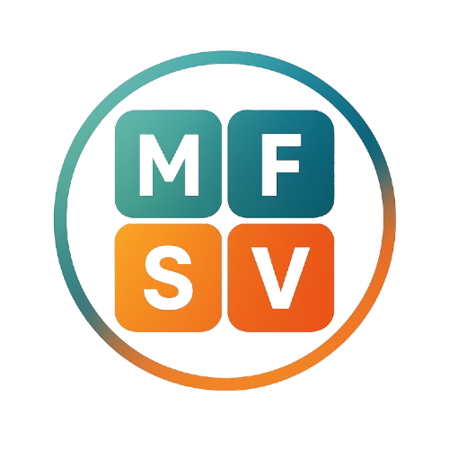

<h1 style="text-align:center;">

SiFri Mail

</h1>

<h3 style="text-align:center;">Save time by organizing your emails.</h3>

  

## Features

- Supports Gmail.
- Categorize email into distinct labels.
- Authenticate with your Google account securely.
- Send and receive messages with a sleek interface.
- Works on every device with Internet access.

## Background

This is the SiFri-Mail project as proposed for the S–CSSE321 and S–CSIS311 classes in De La Salle University – Dasmariñas.